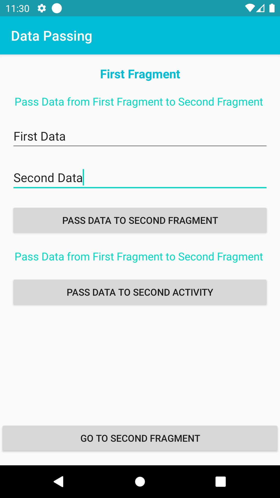
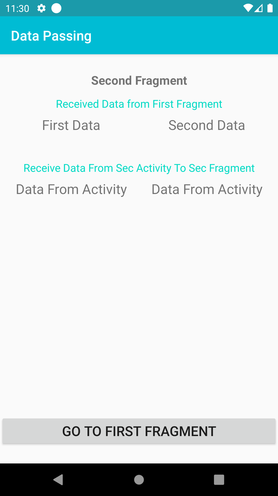
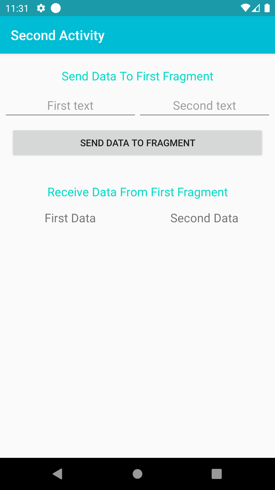

# Data Passing

This project is for learning pass data between activity or fragment in Android App Development.

 - Pass data from fragment to fragment
 - Pass data from fragment to activity
 
## Screenshots
 &nbsp;&nbsp;&nbsp;&nbsp;&nbsp;&nbsp;&nbsp;&nbsp;&nbsp;&nbsp;   &nbsp;&nbsp;&nbsp;&nbsp;&nbsp;&nbsp;&nbsp;&nbsp;&nbsp;&nbsp;  
